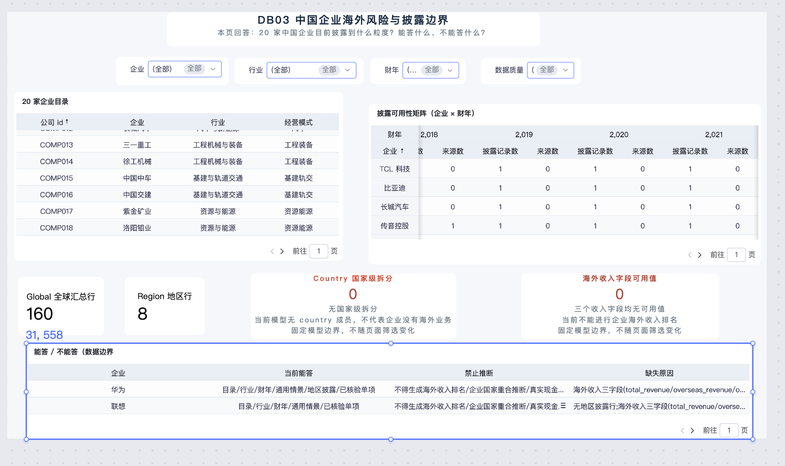
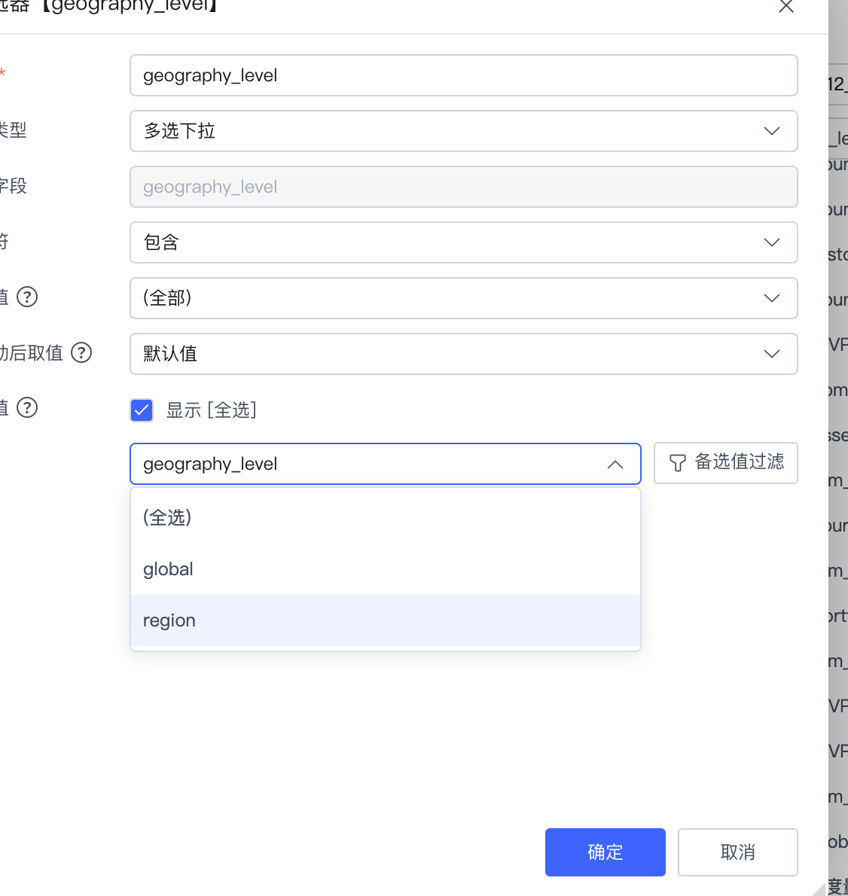

# DB03 Smartbi 正式搭建操作手册｜2026-08-28

> 任务归属：执行者 B｜B01
>
> 当前状态：`DB03 进行中`。`G2 / B00 = PASS（启动放行）`；四个筛选器和四个核心组件已搭出，待展示收尾、联动、性能和正式证据验收。本手册只指导 B 新建和配置 DB03，不修改 A 的正式模型、字段类型、关系或底表。
>
> 当前入口：Smartbi 左侧已进入“分析展现”，页面能看到“分析报表”“我的工作区”以及“交互式仪表盘”等创建入口。

## 一、这次到底要做什么

建设页面“DB03 中国企业海外风险与披露边界”，让使用者看清：

1. 当前收录了哪些企业、行业和财年；
2. 哪些企业—财年组合存在披露记录及来源；
3. 当前数据只有全球级和地区级披露，没有国家级拆分；
4. 现有数据能回答什么、不能推断什么。

这个页面不是企业风险排名页，也不是海外收入排行榜。页面必须如实展示数据缺口，不能把缺失值补成 0，不能把地区披露拆成国家敞口。

## 二、现有线稿和 HTML 怎么用

正式搭建不是重新设计，必须同时对照以下两个现有成果：

1. 结构线稿：[`04_三页线框草稿_V50.md`](./04_三页线框草稿_V50.md)；
2. 可视化预览：[`线框预览/DB03-05-06_线框草案.html`](./线框预览/DB03-05-06_线框草案.html)。

开工前先打开 HTML，保持在“DB03 企业披露边界”页签。Smartbi 正式页应复现它的阅读顺序：

1. 标题和一句话问题；
2. 企业、行业、财年、质量四个筛选器；
3. 第一行左侧企业目录、右侧企业 × 财年披露矩阵；
4. 第二行全宽粒度边界条；
5. 第三行全宽能答/不能答双栏卡；
6. 页脚显示来源、质量、截止期和缺失边界。

HTML 的作用是提供布局、颜色层级、组件顺序和边界文案参考；它带有“B 离线草案 · 非 Smartbi 实机”标记，不能当作平台完成证据，也不能把 HTML 示例值直接复制成 Smartbi 固定文本。

出现冲突时按以下优先级处理：

1. Smartbi 正式模型中的实际字段和数据；
2. `DB03_DB06_搭建参数清单_20260827.md` 的字段、聚合和验收口径；
3. `04_三页线框草稿_V50.md` 的页面结构；
4. HTML 的视觉样式和示例文案。

## 三、最终交付对象和固定名称

| 对象 | 固定名称 | 说明 |
|---|---|---|
| 正式模型 | `MDL_XH202612_V50_COUNTRY_RESERVE` | 只读使用，不修改 |
| DB03 数据集/资源 | `DB03_XH202612_V50_COMPANY_BOUNDARY` | Smartbi 若只要求一次资源命名，就使用这个名称 |
| 页面标题 | `DB03_中国企业海外风险与披露边界` | 页面可见标题 |
| 正式保存位置 | `分析报表 / 上海海洋大学` | 与现有 DB01、DB02 同级，便于双方只读复核 |

如果 Smartbi 分别要求“数据集名称”和“仪表盘名称”，数据集使用 `DB03_XH202612_V50_COMPANY_BOUNDARY`，仪表盘使用 `DB03_中国企业海外风险与披露边界`。

## 四、开工前必须具备的条件

- [x] G2 / B00 已启动放行。
- [x] 正式模型 `MDL_XH202612_V50_COUNTRY_RESERVE` 可查询。
- [x] DB03 的 10 个核心字段已在正式模型字段树中核对可见；其余扩展字段在第 3 步进入创建流程后再逐项确认。
- [x] 当前基线已确定：20 家企业、168 条披露记录、2018—2025 财年、`160 global / 8 region / 0 country`。
- [x] 已在 Smartbi 中创建 DB03 正式资源。
- [x] 已搭出 4 个筛选器和 4 个核心组件。
- [ ] 完成数值、边界、联动和性能验收。

## 五、只允许使用的表和字段

### 1. `V50_dim_company`

- `company_id`
- `company_name_zh`
- `industry`
- `operating_model`

### 2. `V50_company_overseas_exposure`

- `company_id`
- `fiscal_year`
- `geography_id`
- `geography_level`
- `geography_name`
- `geography_revenue`
- `source_id`
- `review_status`
- `quality_flag`
- `total_revenue`
- `overseas_revenue`
- `overseas_revenue_share`

### 3. `V50_MVP_company_data_status`

- `company_id`
- `answer_scope`
- `prohibited_inference`
- `missing_reason`
- `disclosure_rows`
- `disclosed_field_nonnull_count`
- `region_rows`
- `country_rows`
- `unique_source_count`

### 4. `V50_bridge_company_geography`

- `company_id`
- `geography_id`
- `iso3`

该桥表只用于证明当前国家桥接缺失。现有 8 条均为 region 记录，`iso3` 非空数为 0；不得据此制作企业 × 国家地图或国家敞口。

## 六、Smartbi 页面操作步骤

### 先看当前实机进度

截至当前截图，已经完成：

- [x] 进入“分析展现”并新建交互式仪表盘；
- [x] 保存到 `分析报表 / 上海海洋大学`；
- [x] 资源名为 `DB03_XH202612_V50_COMPANY_BOUNDARY`；
- [x] 绑定正式模型 `MDL_XH202612_V50_COUNTRY_RESERVE`；
- [x] 默认“汇总表”已加入 `company_id`、`company_name_zh`、`industry`、`operating_model` 并正常出数；
- [x] 组件 1 标题已设置为“20 家企业目录”，并已按 `company_id` 全局升序显示 `COMP001、COMP002、COMP003…`；
- [x] 当前版本未看到隐藏 `company_id` 的入口，已保留该列并按 `company_id` 全局升序；逻辑自查已通过，展示名仍需从“公司 id”收尾改成“企业编号”；
- [x] 组件 2 已切换为交叉表，行已放 `company_name_zh`，列已放 `fiscal_year`；
- [x] 组件 2 已加入“披露记录数”和 `source_id` 去重计数两个度量；
- [x] 组件 2 复制度量已通过完整定点实测：`华为 × 2020 = 6 / 1`、`中国交建 × 2023/2024/2025 = 2 / 1`，证明 `company_id` 计数和 `source_id` 去重计数逻辑正确；
- [x] 组件 2 行字段“企业”已设置名称全局升序；
- [x] 组件 3 已建立第一张 Global 指标卡：未加粒度条件时 `COUNT(company_id)=168`，加入组件级 `geography_level=global` 后为 160；
- [x] Global 卡已隐藏辅助 `geography_level` 筛选组件，保留了组件级筛选效果；
- [x] Global 卡组件标题已隐藏，度量展示名已改为 `Global 全球汇总行`，默认值 160；
- [x] Region 卡已建立并显示 8，组件标题已隐藏，展示名为 `Region 地区行`；
- [x] Country 固定边界文本卡已建立并显示 0；`geography_level` 值列表无 `country` 的配置证据已保存；
- [x] 海外收入字段可用值固定边界文本卡已建立并显示 0；两份只读 `.xlsx` 的三个收入字段非空数均为 0；
- [x] 企业、行业、财年、数据质量四个多选下拉筛选器已建立；
- [x] 组件 4 已建立并显示“企业、当前能答、禁止推断、缺失原因”；三个边界字段均来自 `V50_MVP_company_data_status`；
- [ ] 组件 2 的年份仍显示为 `2,018 / 2,019`；已确认字段属性弹窗中的“数据格式”只读，应改到组件“属性”页签尝试关闭千分位；若当前版本不提供该开关，记录为平台显示限制，不阻塞数据验收；
- [ ] 组件 2 可见表头保持“企业、披露记录数、来源数”完整，不被列宽裁切；
- [x] 页面标题和问题说明已录入并形成居中层级；平台不能提供的字体细调不作为阻塞；
- [ ] 组件 1 的“公司 id”展示名改为“企业编号”；
- [ ] 隐藏或移除画布左下方多余的蓝色 `31,558`；
- [ ] 四张粒度卡调整为等宽等高、顶部对齐；
- [ ] 组件 4 标题改为“企业数据可答边界（能答 / 不能答）”，长文通过换行、行高和列宽保证可读；
- [ ] 年份能关闭千位分隔符时改成 `2018`；若平台无入口，记录为平台展示限制；
- [ ] 完成 20/168/160/8/0/0、筛选联动、三次操作耗时和正式预览证据验收。

当前页面状态只能写 `DB03 进行中`，不能写 PASS。

当前全页编辑态暂停点截图保存为 `09_DB03_全页_编辑态暂停点_待修正.png`。该图含蓝色选中边框和待处理项，只用于回到任务时定位，不属于正式验收证据。



### 照手册操作时的统一规则

每完成一个小步骤都按以下顺序处理：

1. 先看左侧画布是否出现预期结果；
2. 再点顶部“保存”，避免配置丢失；
3. 如果字段归属、聚合方式、固定筛选或数值不确定，停在当前界面，不继续堆组件；
4. 不用“刷新”“重新拖一遍”掩盖异常，先核对数据集、父表、字段和筛选状态；
5. 样式最后统一调整，先保证字段和数值正确。

### 字段搜索的实机规则

右侧搜索框是字段过滤器，不是自动展开表目录：

- 搜索 `V50_dim_company` 时，只会留下匹配的表节点，子字段可能被过滤掉，看起来像“里面什么都没有”；
- 正确做法是直接逐个搜索字段名，例如 `company_name_zh`；
- 每次拖入字段前必须确认它的父表，避免同名字段来自错误表；
- 拖完一个字段后，再把搜索词替换成下一个字段名；
- 搜索不到时先清空搜索框，再确认正式模型仍为 `MDL_XH202612_V50_COUNTRY_RESERVE`。

### 第 0 步：确认当前入口

你当前应处于左侧菜单“分析展现”主页，能看到：

- 左侧资源树：“分析报表”“我的工作区”；
- 中间创建入口：“交互式仪表盘”“即席查询”“透视分析”“Web 电子表格”。

本任务选择“交互式仪表盘”。不要选择 Web 电子表格，也不要回到“数据准备”新建影子模型。

根据 2026-08-28 当前页面截图，这一步已经完成；实机资源树确认 DB01、DB02 位于 `分析报表 / 上海海洋大学`，DB03 也保存到该目录并与它们同级。

完成标志：页面停留在“分析展现”，准备点击“交互式仪表盘”。

### 第 1 步：确定保存目录

1. 保存对话框的根位置应为“分析报表”。
2. 选中“上海海洋大学”；此时蓝色按钮显示“打开”，表示尚未进入最终目录。
3. 点击“打开”进入“上海海洋大学”，确认其中已有 `DB01_XH202612_V50_RISK_OVERVIEW` 和 `DB02_XH202612_V50_COUNTRY_DRILL`。
4. DB03 直接保存为它们的同级资源，不另建“我的工作区”版本，也不放入 A 的个人子目录。
5. 如果目录中已经存在同名 DB03，先停止并核对，不直接覆盖。

完成标志：保存路径显示为 `分析报表 / 上海海洋大学`，且 DB03 名称没有与现有资源冲突。

### 第 2 步：创建交互式仪表盘

1. 点击“交互式仪表盘”。
2. 选择新建空白仪表盘，不套用会自动增加额外图表的模板。
3. 如果系统先要求选择数据集，进入下一步绑定正式模型。
4. 如果系统先进入空白画布，在“添加数据集/选择数据”时完成下一步。

资源名称使用：`DB03_XH202612_V50_COMPANY_BOUNDARY`。

页面标题使用：`DB03_中国企业海外风险与披露边界`。

建议描述：`B01｜中国企业海外风险与披露边界｜G2 启动放行；基线 20 家/168 行/160 global/8 region/0 country；禁止收入排名和国家拆分。`

停点 A：看到“选择数据集/选择模型”界面时先核对模型名，不要随便选择名称相近的旧对象。

### 第 3 步：绑定正式模型并选择字段

1. 数据来源只选择 `MDL_XH202612_V50_COUNTRY_RESERVE`。
2. 在模型字段树中确认第五节所列四张表可见。
3. 只勾选本手册列出的 DB03 字段；不要一次性把整个模型全部带入。
4. 直接使用模型中已有关系，不新建、不删除、不调整关系。
5. 不上传 Excel，不复制 A 的模型，不创建影子模型。

停点 B：选完字段后，至少截图保留以下字段树可见性：

- `V50_dim_company.company_name_zh`
- `V50_company_overseas_exposure.fiscal_year`
- `V50_company_overseas_exposure.geography_level`
- `V50_MVP_company_data_status.answer_scope`
- `V50_MVP_company_data_status.prohibited_inference`

### 第 4 步：搭页面标题和四个筛选器

当前实际进度已经先搭了组件 1，可以先完成第 5 步的标题和尺寸，再回来执行本步骤；组件的最终阅读顺序仍按 HTML 线稿排列。

#### 4.1 添加页面标题

1. 点击顶部“添加组件”。
2. 选择文本类组件；不同版本可能显示为“文本”“富文本”或“标题”。
3. 放到画布最上方，输入：`DB03 中国企业海外风险与披露边界`。
4. 在标题下方增加一句说明：`本页回答：20 家中国企业目前披露到什么粒度？能答什么、不能答什么？`。
5. 标题和说明只负责展示，不绑定数据，不计入 4 个核心逻辑组件。

当前截图已经录入两行文字并居中；居中方式可以保留，但两行仍是近似同字号，尚未形成正式层级。请在“编辑文本[文本_1]”窗口中按下面顺序设置：

1. 用鼠标只选中第一行 `DB03 中国企业海外风险与披露边界`，不要把第二行一起选中。
2. 字体选“微软雅黑”；如果字体列表没有微软雅黑，选“宋体”，并保证整页统一。
3. 第一行字号选 `18px`，点击 **B** 加粗，文字颜色填 `#15324A`，段落设为居中。
4. 再只选中第二行问题说明，字体保持一致，字号选 `12px`，取消加粗，文字颜色填 `#6B7A86`，段落设为居中。
5. 点击工具栏右侧 `…` 查找“对齐方式”和“行距”；两行都设为居中，行距选 `1.5` 或最接近的档位，段前段后设为 `0`。
6. 文字组件本身保持白底或透明底，不在文字上使用荧光高亮；标题卡片的白底、边框和左侧青绿色强调线在组件属性中设置。
7. 先点右下角“应用”查看画布效果；确认第一行明显大于第二行且整体居中后，再点“确定”。
8. 回到画布，拉宽文本组件，保证两行在正常预览宽度下都不换行；然后点顶部“保存”。

如果这个富文本组件只能整段统一字号、无法分别设置两行，就不要勉强使用同一个文本框：拆成上下两个文本组件。上方标题组件使用 `18px` 粗体，下方问题说明组件使用 `12px` 常规体，两者都水平居中、上下间隔约 3～4 px。

预期结果：页面最上方先出现标题和问题说明，下方才是筛选器和业务组件。

#### 4.2 添加筛选器

1. 点击顶部“添加组件”。
2. 选择“筛选器”或“选择器”类组件；不要点组件悬浮工具条里的漏斗图标，那个图标通常只给当前组件加固定过滤条件。
3. 在右侧数据搜索框逐个搜索下面四个字段。
4. 每创建一个筛选器，就按下表选择明确的组件类型，再把对应字段拖到筛选器字段区并修改中文展示名。
5. 将四个筛选器横向排列在页面标题下方。

页面顶部依次放置：

| 顺序 | 展示名 | Smartbi 组件类型 | 字段 | 推荐设置 |
|---|---|---|---|---|
| 1 | 企业 | **多选下拉** | `V50_dim_company.company_name_zh` | 默认全部；开启搜索；既可选多家，也可只选一家验收边界卡 |
| 2 | 行业 | **多选下拉** | `V50_dim_company.industry` | 默认全部；与企业联动；允许选择多个行业 |
| 3 | 财年 | **多选下拉** | `V50_company_overseas_exposure.fiscal_year` | 默认全部；选项范围应为 2018—2025 |
| 4 | 数据质量 | **多选下拉** | `V50_company_overseas_exposure.quality_flag` | 默认全部；不得隐藏真实质量标签 |

类型选择依据：A/B 总控和 B 执行副计划书规定了 DB03 的筛选维度与交互目标，但没有规定 Smartbi 控件形态；`DB03_DB06_搭建参数清单_20260827.md` 明确企业可单选或多选、默认全选。正式落地将四项统一为“多选下拉”：它最节省画布，天然支持默认全选，也能只勾选一个值完成单企业验收，并保留多企业、多行业和多财年的组合比较能力。

这里的“当前企业”指当前筛选后剩余的企业集合，不等于控件必须是单选。当只勾选一家企业时，边界卡只显示一家；勾选多家或保持全部时，边界卡必须同时显示企业名称，让每条 `answer_scope` 和 `prohibited_inference` 都能明确归属，不能把多家文案拼成一条统一结论。

不要选择“单选列表/多选列表”，避免长期占用画布；不要选择树形控件，因为这四个字段没有需要展示的父子层级；不要给 `fiscal_year` 选择专用“年”控件，因为它是普通财年字段，并非已确认的日期字段。

##### 4.2.1 原计划、参数清单和线框的差异怎么裁决

- A/B 双人总控计划书负责规定对象归属和共同规则：DB03 由 B 唯一写入，A 只读复核；页面不超过 4 个核心组件，来源、质量和限制必须可见。
- B 执行副计划书负责规定业务目标：企业目录按企业/行业筛选，披露矩阵按财年/质量复核，边界卡跟随当前企业；其后续步骤中曾概括写为“企业、行业、财年、披露粒度筛选”。
- 2026-08-27 的 DB03 搭建参数清单和最终线框把顶部四个筛选器固化为“企业、行业、财年、数据质量”。这是更晚、更具体的 DB03 落地参数。
- 因此正式页顶部只放“企业、行业、财年、数据质量”四个筛选器。`geography_level` 不再增加为第五个页面筛选器：Global、Region 两张数据卡分别使用组件级固定条件；Country 因事实表中没有 `country` 成员，使用明确标注证据来源的固定边界说明卡。
- 这样既满足原计划对“披露粒度可核验”的要求，也不会让用户把 `global / region / country` 当成默认隐藏范围，更不会破坏 `160 / 8 / 0` 三卡同时可见的诚实边界。

遇到文档表述不一致时，本页按以下顺序执行：正式模型实际字段 → 2026-08-27 搭建参数清单 → 三页线框 → B 执行副计划书的概括性步骤 → HTML 视觉示例。

##### 4.2.2 四个筛选器逐个创建

**筛选器 1：企业**

1. 在“筛选器”分类点击 **多选下拉**。
2. 将新组件放到标题下方最左侧。
3. 搜索 `company_name_zh`，确认父表为 `V50_dim_company`，再拖入筛选字段区。
4. 展示名改为“企业”；默认值选择“全部”；开启搜索、全选和清空/恢复全部。
5. 作用范围选择本页所有数据绑定组件；Country 和海外收入字段可用值是固定模型边界说明卡，不需要加入筛选作用范围。
6. 验证：默认仍显示 20 家；只勾选任意一家后，企业目录、矩阵、Global/Region 数据卡和能答/不能答卡都随之变化；Country 与海外收入字段可用值两张固定边界说明卡仍显示 0。能答/不能答卡只剩当前企业；再勾选第二家时，两家记录必须分别带企业名称。

**筛选器 2：行业**

1. 在“筛选器”分类点击 **多选下拉**。
2. 放到企业筛选器右侧。
3. 搜索 `industry`，确认父表为 `V50_dim_company`，再拖入筛选字段区。
4. 展示名改为“行业”；默认值选择“全部”；开启搜索、全选和清空功能。
5. 作用范围选择本页所有数据绑定组件，并与企业筛选器联动；两张固定边界说明卡不参与动态筛选。
6. 验证：选择一个行业时，企业下拉选项和企业目录同步缩小；恢复全部后重新显示完整企业集合。

**筛选器 3：财年**

1. 在“筛选器”分类点击 **多选下拉**，不要点击专用“年”组件。
2. 放到行业筛选器右侧。
3. 搜索 `fiscal_year`，确认父表为 `V50_company_overseas_exposure`，再拖入筛选字段区。
4. 展示名改为“财年”；默认值选择“全部”；选项按升序排列并应覆盖 2018—2025。
5. 作用范围选择本页所有数据绑定组件，至少必须控制披露矩阵和 Global/Region 数据卡；Country 与海外收入字段可用值是固定模型边界说明卡，不参与动态筛选。
6. 验证：选择一个或多个财年后，矩阵对应年份和 KPI 数值发生合理变化；恢复全部后回到 2018—2025 和 168 行基线。

**筛选器 4：数据质量**

1. 在“筛选器”分类点击 **多选下拉**。
2. 放到财年筛选器右侧，形成“企业｜行业｜财年｜数据质量”的固定顺序。
3. 搜索 `quality_flag`，确认父表为 `V50_company_overseas_exposure`，再拖入筛选字段区。
4. 展示名改为“数据质量”；默认值选择“全部”；保留模型返回的全部真实标签，不自行合并、改名或隐藏低质量状态。
5. 作用范围选择本页所有数据绑定组件；两张固定边界说明卡不参与动态筛选。
6. 验证：切换质量标签后，矩阵和 Global/Region 数据卡随之变化；Country 与海外收入字段可用值两张边界说明卡固定显示 0，因为它们表达当前模型的整体数据边界，不是当前筛选后的业务计数。恢复全部后重新回到 168 行及 `160 / 8 / 0 / 0` 基线。

四个筛选器全部创建后，横向从左到右排列，宽度尽量一致。每完成一个就先点顶部“保存”；全部完成后恢复为“全企业、全行业、全财年、全质量”再开始对默认基线。

联动要求：

- 四个筛选器应控制所有数据绑定组件；Country 与海外收入字段可用值两张固定边界说明卡除外；
- 选择企业后，“能答/不能答边界卡”必须切换到当前企业；
- 不得默认过滤掉空值或质量较差记录，除非页面显式显示正在使用的过滤条件。

#### 4.3 筛选器属性

- 企业：使用“多选下拉”，默认全部，开启搜索、全选和清空；只勾一家时边界卡只显示该企业，多选时每条边界文案必须带企业名称；
- 行业：使用“多选下拉”，默认全部；选择一个或多个行业后，企业列表和组件结果应同步缩小；
- 财年：使用“多选下拉”，默认全部；可选值应覆盖 2018—2025；
- 数据质量：使用“多选下拉”，默认全部；不得预先只保留高质量记录；
- 如果属性中出现“作用范围”“联动范围”或类似选项，选择本页所有 4 个核心组件；
- 如果没有统一作用范围，等四个组件全部创建后，在“交互”页签逐个补齐联动。

完成标志：默认状态为全企业、全行业、全财年、全质量状态。

### 第 5 步：组件 1——企业目录表

组件类型：明细表或交叉表。

#### 5.1 使用当前默认汇总表

新建仪表盘后画布上已有一个默认“汇总表”，直接把它作为组件 1，不需要删除重建。

1. 单击画布上的默认汇总表，使其出现蓝色边框。
2. 中间“组件设置”保持在“数据”页签，组件类型保持“汇总表”。
3. 右侧搜索框输入 `company_name_zh`，确认父表为 `V50_dim_company`。
4. 将 `company_name_zh` 拖到中间“列”区域。
5. 依次把搜索词改成 `industry`、`operating_model`，确认父表后拖入“列”。
6. 字段顺序保持：`company_name_zh`、`industry`、`operating_model`。

预期结果：左侧表格出现企业、行业、经营模式三列，并能看到企业明细行。当前截图已经达到该状态。

字段顺序：

1. `company_id`，展示名“企业编号”；用于全局升序和对账；
2. `company_name_zh`，展示名“企业”；
3. `industry`，展示名“行业”；
4. `operating_model`，展示名“经营模式”。

设置要求：

- `company_id` 设置“全局升序”，不要选择“组内升序”；
- 平台支持隐藏列时可把 `company_id` 隐藏；当前实机菜单未出现隐藏入口时，允许保留为第一列，展示名改成“企业编号”，列宽缩到能完整显示 `COMP001` 即可；
- 保留企业编号不增加核心组件数量，也不改变业务口径，且能直接证明排序和源表对账关系，因此属于正式可接受方案，不是临时错误；
- 默认状态应显示 20 家企业；
- 不添加海外收入排名、风险评分或企业优劣排序；
- 不用 `total_revenue`、`overseas_revenue`、`overseas_revenue_share` 生成数值榜单。

#### 5.2 设置组件标题和尺寸

1. 保持组件选中，点击中间“属性”页签。
2. 查找“标题”“组件标题”或同义设置，打开标题显示并填写：`20 家企业目录`。
3. 如果当前版本没有组件标题输入框，就在表格上方增加一个静态文本组件写“20 家企业目录”，不要随意修改字段别名充当标题。
4. 拖动画布上组件边框的控制点，将表格放到首行左半区；至少保证三列表头和多行数据可读。
5. 搜索 `company_id` 并加入表格，对该列设置“全局升序”。如果平台必须显示该列才能排序，就正式保留该列：展示名改为“企业编号”，放在第一列，列宽建议约 90～110 px；不要改回按企业名称排序。
6. 正确排序后的前五行应为：`COMP001 华为`、`COMP002 联想`、`COMP003 中兴通讯`、`COMP004 传音控股`、`COMP005 海尔智家`。

#### 5.3 组件 1 自查

- [ ] 表头为企业编号、企业、行业、经营模式；如果平台能隐藏排序列，才允许只显示后三列；
- [ ] `company_id` 使用全局升序，前五行与 `COMP001～COMP005` 对应企业一致；
- [ ] 没有收入、风险分数或排名字段；
- [ ] 默认状态应有 20 家企业，不因分页只看到几行就误判为数据不足；
- [ ] 搜索、排序和显示均来自 `V50_dim_company`；
- [ ] 完成后点击顶部“保存”。

验收点：`COUNT_DISTINCT(company_id) = 20`。

### 第 6 步：组件 2——企业 × 财年披露可用性矩阵

组件类型：交叉表；平台支持时可使用热力格式，但数值必须可见。

#### 6.1 新建组件 2

1. 点击顶部“添加组件”，新建一个表格类组件。
2. 在组件类型中优先选择“交叉表”“透视表”或能分别配置行、列、度量的表格；不要直接复制组件 1 的三列明细表后就当作矩阵。
3. 把组件放到首行右半区，与企业目录表左右并列。
4. 标题设置为：`披露可用性矩阵（企业 × 财年）`。

#### 6.2 拖入矩阵字段

右侧搜索框仍按“逐个搜索字段名”的方式操作：

1. 搜索 `company_name_zh`，确认父表为 `V50_dim_company`，拖入“行”。
2. 搜索 `fiscal_year`，确认父表为 `V50_company_overseas_exposure`，拖入“列”。不要选择顶部自动生成的同名时间层级，除非它明确来自该字段并能显示 2018—2025 年。
3. 搜索 `company_id`，必须确认父表为 `V50_company_overseas_exposure`。当前实机中它带 `Ab` 图标，被识别为文本维度，不能直接拖进“度量”。
4. 点击该字段右侧 `⋮`，选择 **“复制转度量”**。不要选择其他表的同名 `company_id`，也不要使用会删除原维度的“转度量”。
5. 在数据区找到复制后生成的度量字段，把它拖入“度量/值”，聚合方式改为“计数”，展示名改为“披露记录数”。
6. 搜索 `source_id`，确认同样来自 `V50_company_overseas_exposure`；如果它也显示为 `Ab` 文本维度，就同样选择“复制转度量”，将复制后的字段拖入第二个“度量/值”。
7. `source_id` 的聚合方式必须选择“去重计数”，展示名改为“来源数”；不能选择普通计数冒充来源数。
8. 点击顶部“保存”。

行排序设置：选中交叉表行区的 `company_name_zh`（展示名“企业”），选择“排序 → 全局升序”。组件 2 只按企业名称稳定排序，不再加入 `company_id`；不要选择“组内升序”，也不要按“披露记录数”或“来源数”排序，否则容易形成不需要的企业高低排名。组件 1 才使用 `company_id` 升序做目录对账，这两个组件的排序目的不同。

当前源表共 168 行，`V50_company_overseas_exposure.company_id` 非空 168 行，因此对复制后的该字段使用 `COUNT`，默认全选状态应准确得到 168，不会因空值少算。这里不要改用 `V50_dim_company.company_id`：后者表达 20 家企业数量，不是 168 条披露记录。

复制完成后必须把鼠标放到右侧“自定义度量”的字段上，查看提示中的来源/别名：

- `company_id` 必须明确来自 `V50_company_overseas_exposure`；如果提示为 `V50_dim_company`、`V50_bridge_company_geography` 或 `V50_MVP_company_data_status`，立即从组件“度量”区移除该错误字段，再从事实表重新“复制转度量”；
- `source_id` 也必须来自 `V50_company_overseas_exposure`，不能从 `V50_source_registry` 复制；
- 为避免两个同名复制度量混淆，复制后优先将自定义度量分别命名为“披露记录数”和“披露来源数”，组件展示名再设为“披露记录数”和“来源数”。

当前截图中的年份显示为 `2,018 / 2,019`，属于数值显示格式问题，不是数据年份错误。实机字段属性弹窗已确认：`fiscal_year`/复制后的 `fiscal_year2` 数据类型仍为“整型”，数据格式显示 `<整型-默认值>` 且为灰色只读。这里的“属性”只是字段元数据和显示名称设置，不能关闭千分位；复制字段也不会把整数转换成字符串。

正确处理顺序：

1. 在当前字段属性弹窗中只把“显示名称”设为“财年”，然后点“确定”；不要继续复制 `fiscal_year3`、`fiscal_year4`。
2. 回到画布选中交叉表，点击中间“组件设置”的 **“属性”页签**，不是列字段右侧的字段属性弹窗。
3. 查找“数据格式”“数字格式”“列头格式”或“千分位”设置；如果能按字段选择，选择 `fiscal_year`，设为整数、0 位小数并关闭千分位。
4. 如果组件“属性”中也没有年份/列头格式开关，保留 `2,018～2,025`，在验收记录中注明“Smartbi 当前版本对整型维度列头自动使用千分位；底层值仍为 2018～2025”。这属于展示限制，不影响 168 行、筛选和聚合验收。
5. 不要为去逗号修改 A 的正式模型，不要新建影子模型，也不要改用 `V50_dim_year.year_key`：该字段同样是整数，仍可能使用相同默认格式。

因此“年份无逗号”是优先视觉目标，不是本页硬失败条件。数据来源、年份范围和矩阵计数正确时，不得为了一个显示逗号拖慢 DB03 进度。

字段放置：

- 行：`V50_dim_company.company_name_zh`；
- 列：`V50_company_overseas_exposure.fiscal_year`；
- 值 1：“披露记录数”=`COUNT(V50_company_overseas_exposure.company_id)`；
- 值 2：“来源数”=`COUNT_DISTINCT(V50_company_overseas_exposure.source_id)`。

提示字段：

- `geography_level`
- `geography_name`
- `geography_revenue`
- `review_status`
- `quality_flag`
- `source_id`

如果当前组件不支持 `COUNT_DISTINCT`：

1. 不得使用普通 `COUNT(source_id)` 冒充来源数；
2. 将“来源数”移出矩阵；
3. 增加可展开明细或提示字段展示 `source_id`，并在页面说明“来源数未做去重汇总”。

解释文案：本矩阵表示“已收录的披露记录和来源”，不代表企业真实海外收入规模。

#### 6.3 矩阵自查

不要看到表格大部分单元格为 `1 / 0` 就判定配置错误。源表 160 个企业—财年组合中，只有 4 个组合存在多条披露记录；其余 156 个组合的披露记录数本来就是 1。`source_id` 共 149 行为空，因此大量来源数为 0 也是真实结果。

按下面顺序做定点验收：

1. 页面筛选器恢复“全行业、全质量”，企业只勾选“华为”，财年只勾选 2020；矩阵应显示“披露记录数 6、来源数 1”。
2. 企业改为“中国交建”，财年勾选 2023、2024、2025；三个年份均应显示“披露记录数 2、来源数 1”。
3. 再恢复企业和财年为全部；默认矩阵应覆盖 160 个企业—财年组合。当前交叉表如果没有直接显示总计，不新建临时卡、不手工相加，先保存组件 2。
4. 只有上述定点值仍显示 1，才判定 `company_id` 度量来源错误；此时打开自定义度量属性截图，核对路径必须来自 `V50_company_overseas_exposure.company_id`。

2026-08-28 实机截图已确认全部定点：`华为 × 2020 = 6 / 1`、`中国交建 × 2023/2024/2025 = 2 / 1`。因此当前两个复制度量无需删除或重建；组件 2 后续只补企业名称全局升序并保存，不再重复排查已经通过的字段来源。默认总行数 168 留到组件 3 用 `160 global + 8 region + 0 country` 交叉验证。

- [ ] 行是企业，列是 2018—2025 财年；
- [ ] 行字段“企业”使用名称全局升序，没有增加 `company_id` 列，也没有按披露记录数/来源数做排名；
- [ ] 优先将 `fiscal_year` 显示为 `2018` 而不是 `2,018`；若组件属性不支持关闭整型维度千分位，已在验收记录中注明平台显示限制，且确认底层年份仍为 2018—2025；
- [ ] 披露记录数使用 `COUNT(company_id)`，没有使用求和；
- [ ] 使用的是 `V50_company_overseas_exposure.company_id` 的复制度量，不是桥表、企业维表或状态表里的同名字段；
- [ ] 来源数使用去重计数，或已按替代方案展示明细；
- [ ] 表头已改为“企业、披露记录数、来源数”，没有显示截断的 `company_...` 或 `source_id（唯一计数）...`；
- [ ] 默认总行数在组件 3 通过 `160 global + 8 region + 0 country = 168` 完成核对；不要求在当前矩阵中手工相加；
- [ ] 默认状态共有 160 个企业—财年组合；`华为 × 2020 = 6`，`中国交建 × 2023 = 2`、`× 2024 = 2`、`× 2025 = 2`，其余组合的披露记录数为 1；
- [ ] `source_id` 当前有 149 行为空，因此部分“来源数”显示 0 是真实结果，不得补成 1；
- [ ] 没有把空白企业—财年组合填成收入或风险数值；
- [ ] 组件标题和左右布局与 HTML 线稿一致。

验收点：默认状态披露记录总数为 168，财年范围为 2018—2025。

### 第 7 步：组件 3——披露粒度边界

组件表现：同一区域内并排放置四张指标卡，作为一个逻辑组件。

#### 7.1 创建第一张指标卡

1. 点击顶部“添加组件”，选择“指标卡”“数字卡”或同类单值组件。
2. 搜索 `company_id`，确认父表为 `V50_company_overseas_exposure`。
3. 如果数据区已有第 6 步创建的 `company_id` 复制度量，直接使用；否则点击原文本维度右侧 `⋮`，再次选择“复制转度量”。
4. 将复制后的度量拖入指标/度量区，聚合方式设置为“计数”。
5. 如果维度区也勾选了原始 `company_id`，先取消它；指标卡必须保持“维度 0 个、指标 1 个”，否则会按 `COMP001、COMP002…` 拆成多格。
6. 先记录未加粒度条件的基线：当前实机 `COUNT(company_id)=168`，证明度量和聚合方式正确。
7. 保持指标卡处于选中状态，点击画布最右侧竖排的“筛选器”页签。
8. 在展开面板的第一区“影响此组件的筛选器”中，将 `V50_company_overseas_exposure.geography_level` 拖入“拖入字段”虚线框。不得放入第二区“影响此页上多个组件的筛选器”。
9. 在生成的 `geography_level` 筛选组件中只选 `global`，指标卡应从 168 变为 160。
10. 选中辅助 `geography_level` 筛选组件，通过其“更多”菜单选择“隐藏组件”；只隐藏辅助筛选组件，不隐藏 160 指标卡。隐藏后再次确认数值仍为 160。
11. 选中指标卡，在悬浮工具条的“更多”菜单中选择“隐藏标题”；再将度量展示名从 `company_id` 改为 `Global 全球汇总行`。最终卡内只保留这一行业务标签和数值 160，不上下重复两层标题，也不向业务复核人暴露底层技术字段名。
12. 点击顶部“保存”。默认全选状态预期值为 160。

实机确认的入口说明：

- 组件工具条中的“作为筛选器”是让指标卡去筛选其他组件，不是给当前卡增加固定条件；
- 组件工具条的“更多”菜单只有隐藏标题、隐藏组件、复制等功能，没有固定过滤入口；
- “属性”页签的搜索框只搜索属性项，不能通过输入“过滤条件”创建筛选；
- `geography_level` 必须选自 `V50_company_overseas_exposure`，不得选同名的 `V50_bridge_company_geography.geography_level`。

#### 7.2 复制 Region 卡并建立 Country 边界说明卡

1. 选中 Global 卡，打开悬浮工具条的“更多”菜单，点击“复制”；在画布空白处粘贴一次作为 Region 卡。如果平台不支持完整复制，则新建一张指标卡，仍只使用同一个 `V50_company_overseas_exposure.company_id` 计数度量。
2. 选中第二张卡，打开右侧“筛选器”面板，检查第一区“影响此组件的筛选器”：
   - 如果复制后已带入 `geography_level=global`，只把选值改为 `region`；
   - 如果没有带入，重复 7.1 的拖入操作，再只选 `region`。
3. 确认第二张卡为 8，然后隐藏它自己的辅助 `geography_level` 筛选组件。不要删除或改动 Global 卡的筛选器。
4. 第二张卡同样选择“隐藏标题”，将度量展示名改为 `Region 地区行`。
5. 再次打开 `V50_company_overseas_exposure.geography_level` 的值列表。当实机中只显示 `global` 和 `region`、不显示 `country` 时，这是“Country 记录数为 0”的直接证据，不是平台故障。**当前弹窗直接点右下角“取消”**；不要选 `region` 代替，也不要手工向模型补 `country`。

##### 7.2.1 Country 卡到底是什么

Country 卡和 Global/Region 卡的做法不同：

- Global、Region 是绑定数据字段的动态指标卡；
- Country 是不绑定数据集、不拖字段、不添加筛选条件的静态文本/富文本说明卡；
- 因为值列表没有 `country`，所以不能复制 Global 卡后再选择一个不存在的成员；
- 固定写 0 的依据就是“值列表仅有 global/region”的实机证据，必须同时写明它是模型边界，不是当前筛选结果。

##### 7.2.2 Country 卡逐步点击方法

1. 关闭 `geography_level` 值列表后，回到页面画布；此时不要再复制 Global 卡，也不要继续给任何指标卡添加 `country` 条件。
2. 点击顶部 **“添加组件”**。
3. 在组件列表中找到 **“文本”或“富文本”** 组件；不同 Smartbi 版本可能显示其中一个名称，它属于静态说明组件，不是“指标卡”也不是“筛选器”。
4. 点击或拖入该组件，把它放在 Region 卡右侧，作为第三张卡。
5. 打开文本编辑区，按下面五行原样输入：

   ```text
   Country 国家级拆分
   0
   无国家级拆分
   当前模型无 country 成员，不代表企业没有海外业务
   固定模型边界，不随页面筛选变化
   ```

6. 选中第二行数字 `0`，在字号下拉框继续向下滚动并选择 **`26px`**，再设置粗体、红色 `#C0392B`、居中。
7. 第一行 `Country 国家级拆分` 设置为 **`12px`、常规或中等字重、红色 `#C0392B`、居中**；其余三行说明统一设置为 **`11px` 或 `12px`、常规字重、灰色 `#6B7A86`、居中**。
8. 组件背景设置为浅红 `#FDEBEC`，边框设置为 `1 px #C0392B`，圆角约 `8 px`；整体宽度、高度与 Global、Region 卡一致。
9. 如果文本组件外面又显示了一层系统标题，选中该组件，打开悬浮工具条“更多”，选择 **“隐藏标题”**。卡内保留上面五行业务文字即可。
10. 这张卡**不选择数据集、不拖 `company_id`、不拖 `geography_level`、不设置任何筛选条件**。右侧数据字段区保持空白是正确状态。
11. 点击顶部“保存”，再进入预览。默认页面应同时看到 Global 160、Region 8、Country 0；切换企业、行业、财年或质量时，Global/Region 可以变化，Country 始终固定为 0，这是预期行为。

恢复默认页面筛选后，Global 数据卡、Region 数据卡和 Country 边界说明卡必须同时显示 `160 / 8 / 0`，其中前两张为动态数据卡，Country 为固定边界卡。`160 + 8 = 168` 完成总行数对账，Country 的 0 不改变合计。

实机截图要求：保留一张 `geography_level` 值列表只显示 `global / region`、没有 `country` 的配置证据，作为 Country=0 边界卡的来源证明。

#### 7.3 添加收入字段可用值卡

当前基线已用两份只读 `.xlsx` 交叉核对：交付包和 A 的输入只读镜像均为 168 行，`total_revenue`、`overseas_revenue`、`overseas_revenue_share` 三列非空数量分别为 `0 / 0 / 0`，合计 0。因此第四张采用明确标注证据来源的固定文本边界卡，现场不做额外计算配置。

1. 选中已经做好的 Country 文本卡，打开悬浮工具条“更多”，点击“复制”，再粘贴到 Country 右侧。不要复制 Global/Region 数据指标卡。
2. 双击新复制的文本卡，删除原 Country 文案，按下面五行原样输入：

   ```text
   海外收入字段可用值
   0
   三个收入字段均无可用值
   当前不能进行企业海外收入排名
   固定模型边界，不随页面筛选变化
   ```

3. 第一行标题设置为 `12px`、粗体或中等字重、红色 `#C0392B`、居中。
4. 第二行数字 `0` 设置为 `26px`、粗体、红色 `#C0392B`、居中。
5. 后面三行说明文字统一设置为 `11px` 或 `12px`、常规字重、灰色 `#6B7A86`、居中。
6. 组件背景设置为浅红 `#FDEBEC`，边框设置为 `1 px #C0392B`，圆角约 `8 px`。
7. 这张卡不选择数据集、不拖 `total_revenue`、`overseas_revenue` 或 `overseas_revenue_share`，也不设置筛选条件；它表达当前正式模型的固定可用性边界。
8. 将 Global、Region、Country、海外收入字段可用值四张卡横向排列，统一宽度和高度，卡间距约 `12 px`。
9. 点击顶部“保存”，进入预览后确认四张卡为 `160 / 8 / 0 / 0`；切换页面筛选时，Global/Region 可以变化，后两张固定边界卡保持 0。
10. 模型刷新或收入字段补数后，必须重新核对三个字段非空数量，并同步更新或取消这张固定边界卡，不能永久沿用旧的 0。

Global、Region 两张数据卡使用披露记录数 `COUNT(company_id)` 并设置各自的组件级固定条件；Country 和海外收入字段可用值均为带证据说明的固定边界文本卡：

| 卡片 | 固定条件 | 默认基线 |
|---|---|---:|
| Global 记录 | `geography_level = global` | 160 |
| Region 记录 | `geography_level = region` | 8 |
| Country 边界 | 值列表无 `country`；固定边界说明卡 | 0 |
| 海外收入字段可用值 | 三个收入字段非空数均为 0；固定边界文本卡 | 0 |

设置要求：

- Country 为 0 时必须显示“0｜无国家级拆分”，不能隐藏卡片；
- Global、Region 随企业、行业、财年和质量筛选变化；Country 与海外收入字段可用值两张固定边界卡保持 0，并明示不随筛选变化；
- 0 表示当前没有国家级披露记录，不表示企业没有海外业务；
- 不创建国家地图，不把 region 拆成 iso3。

#### 7.4 粒度卡自查

- [x] Global 卡使用 `V50_company_overseas_exposure.company_id` 计数，未加粒度条件时为 168；
- [x] Global 卡通过“影响此组件的筛选器”固定 `geography_level=global`，实机显示 160；
- [x] Global 卡的辅助 `geography_level` 筛选组件已隐藏，指标值仍为 160；
- [ ] Global 卡已隐藏组件标题，度量展示名已改为 `Global 全球汇总行`，并已保存；
- [ ] Region 已隐藏组件标题，展示名中不再出现 `company_id`；Country 与海外收入字段可用值均已建立为同尺寸的固定边界文本卡；
- [ ] Global=160、Region=8、Country=0；
- [ ] 前三张卡合计为 168；
- [ ] 收入字段可用值为 0，且明确解释为三个收入字段非空数均为 0；说明文字颜色为 `#6B7A86`；
- [ ] Global/Region 固定条件分别绑定在各自卡片上，没有把 `global/region` 做成全页默认筛选；
- [ ] Country=0 使用固定边界说明卡，已保留“值列表无 `country`”证据，并带诚实边界说明；
- [ ] Global/Region 能够接受页面企业、行业、财年、质量筛选器的联动；Country 与海外收入字段可用值两张边界卡保持固定 0。

验收点：默认状态显示 `160 / 8 / 0 / 0`；前三个粒度值合计 168，第四个值证明三个收入字段当前均无可用值。

### 第 8 步：组件 4——能答 / 不能答边界卡

数据来源：边界字段来自 `V50_MVP_company_data_status`；企业展示名来自已关联的 `V50_dim_company`。

推荐表现：双栏文字表或文字卡。

#### 8.1 创建动态边界组件

1. 点击顶部“添加组件”，选择能展示长文本的汇总表、明细表或文字卡。
2. 标题设置为：`企业数据可答边界（能答 / 不能答）`。
3. 先搜索 `company_name_zh`，确认父表为 `V50_dim_company`，拖入第一列并改名为“企业”。这是企业多选时区分每条边界文案的必要字段，不得隐藏。
4. 搜索 `answer_scope`，确认父表为 `V50_MVP_company_data_status`，拖入“当前能答”列。
5. 搜索 `prohibited_inference`，必须确认父表仍是 `V50_MVP_company_data_status`，再拖入并改名为“禁止推断”。
6. 搜索 `missing_reason` 时会出现多个同名字段。**只勾选 `V50_MVP_company_data_status` 文件夹下的 `missing_reason`**，拖入并改名为“缺失原因”。当前实机列表中它位于 `V50_country_exposure`、`V50_MVP_country_latest` 之后，父表行带绿色勾；不得选择其他三张表的同名字段。
7. 需要辅助数字时，再依次从 `V50_MVP_company_data_status` 加入 `disclosure_rows`、`region_rows`、`country_rows`、`unique_source_count`；不要为了好看一次性堆满所有字段。
8. 将组件放到粒度卡下方，横向占满页面；视觉上参考 HTML 的绿色“能答”和红色“不能答”双栏。
9. 点击顶部“保存”。

字段父表和展示名必须按下表设置，不在正式页面显示英文底层字段名：

| 父表 | 底层字段 | 展示名 |
|---|---|---|
| `V50_dim_company` | `company_name_zh` | `企业` |
| `V50_MVP_company_data_status` | `answer_scope` | `当前能答` |
| `V50_MVP_company_data_status` | `prohibited_inference` | `禁止推断` |
| `V50_MVP_company_data_status` | `missing_reason` | `缺失原因` |
| `V50_MVP_company_data_status` | `disclosure_rows` | `披露记录数` |
| `V50_MVP_company_data_status` | `disclosed_field_nonnull_count` | `可用字段数` |
| `V50_MVP_company_data_status` | `region_rows` | `Region 行数` |
| `V50_MVP_company_data_status` | `country_rows` | `Country 行数` |
| `V50_MVP_company_data_status` | `unique_source_count` | `来源数` |

前四列是组件 4 的必选字段；后五个辅助数字按画布空间选用，不要求全部加入。

`missing_reason` 同名字段选择表：

| 搜索结果父表 | DB03 是否选择 | 原因 |
|---|---|---|
| `V50_country_exposure` | 否 | 国家敞口页字段，不属于企业披露边界 |
| `V50_MVP_country_latest` | 否 | 国家最新状态字段，不属于当前企业组件 |
| `V50_MVP_company_data_status` | **是** | DB03 企业数据状态与边界的正式来源 |
| `V50_MVP_cycle_state` | 否 | 全球周期页字段，不属于 DB03 |

设置要求：

- 企业筛选器必须控制该组件；
- 文案必须显示当前筛选企业对应的真实内容；默认全部或多选时，每条记录都必须保留企业名称；
- 不把某一家企业的边界文案写成所有企业都成立；
- 不在此处添加模型生成的风险建议或主观补充。

#### 8.2 边界卡自查

- [ ] 企业筛选器选择单家企业时，边界卡只展示当前企业对应的记录；
- [ ] 企业筛选器选择两家企业时，边界卡分别显示两家企业名称和各自文案，没有合并成统一结论；
- [ ] `answer_scope` 和 `prohibited_inference` 没有被写成固定静态文案；
- [ ] `answer_scope`、`prohibited_inference`、`missing_reason` 三列父表均为 `V50_MVP_company_data_status`，没有混入其他表的同名字段；
- [ ] 四个必选字段展示名已改为“企业 / 当前能答 / 禁止推断 / 缺失原因”，页面未显示英文底层字段名；
- [ ] `missing_reason` 为空时保持空，不自行补原因；
- [ ] 切换至少 3 家企业，内容或辅助数字随筛选变化；
- [ ] 页面不存在国家敞口、企业排名或真实现金需求等禁止结论。

验收点：切换至少 3 家企业，文案和辅助数字均随筛选变化。

### 第 9 步：页面布局与说明

推荐布局：

```text
标题：DB03 中国企业海外风险与披露边界
筛选器：企业｜行业｜财年｜数据质量

企业目录表                 企业 × 财年披露矩阵

Global 160｜Region 8｜Country 0（无国家级拆分）｜海外收入字段可用值 0

当前能答                   禁止推断 / 缺失原因

数据截止期｜source_id｜review_status｜quality_flag｜边界说明
```

页面规则：

- 核心逻辑组件不超过 4 个；四张粒度卡合并视为一个逻辑组件；
- 来源、审核状态、质量和限制必须可见或可通过提示查看；
- 数值空值保持空，不显示为 0；
- 表格列名使用易懂的中文展示名，但保留原字段口径；
- 首屏先保证可读和可核验，不追求复杂动效。

#### 9.1 按 HTML 调整布局

1. 打开 `线框预览/DB03-05-06_线框草案.html`，停在 DB03 页签。
2. 回到 Smartbi，把企业目录放左上、披露矩阵放右上。
3. 四张粒度卡放在第二行并横向占满。
4. 能答/不能答边界卡放第三行并横向占满。
5. 页面底部增加静态说明：`各指标独立数据截止期｜source_id 可见｜质量标记可见｜缺失保持空｜本页 4 个核心逻辑组件`。
6. HTML 中的示例企业、示例数值和示例文案只用于预览，不复制成固定业务数据。

#### 9.2 整页视觉参数总表

以下参数来自现有 HTML 线稿，是 DB03 正式页的统一视觉基准。Smartbi 属性名称可能略有不同；能输入色值时优先直接填十六进制色值，只能选主题色时选择最接近的颜色并保持同类组件一致。

##### 9.2.1 字体、字号与对齐

全页字体优先级：`Microsoft YaHei（微软雅黑）` → `PingFang SC（苹方）` → `宋体`。同一页面不要混用多种中文字体。

| 对象 | 字号（Smartbi 下拉值） | 字重 | 颜色 | 对齐 | 备注 |
|---|---:|---|---|---|---|
| 页面主标题 | `18px` | 粗体/700 | `#15324A` | 居中 | 不加下划线，不全大写 |
| 标题下问题说明 | `12px` | 常规/400 | `#6B7A86` | 居中 | 重点短语可用青绿色，不整句加粗 |
| 筛选器标签和选项 | `12px` | 常规/400 | `#1F2A33` | 左 | 四个筛选器字号一致 |
| 组件标题 | `14px` | 粗体/700 | `#15324A` | 左 | 标题下方保留细分隔线 |
| 表头 | `12px` | 半粗/600 | `#15324A` | 文本左、数字中 | 表头使用浅底色 |
| 表格正文 | `12px` | 常规/400 | `#1F2A33` | 文本左、数字中或右 | 同列对齐必须一致 |
| KPI 数值 | `26px` | 粗体/700 | 见 KPI 规则 | 居中 | `160 / 8 / 0 / 0` 层级最强 |
| KPI 标签 | `12px` | 常规/400 | `#6B7A86` | 居中 | 最多两行，不截断关键边界 |
| “能答/不能答”栏标题 | `13px`；空间充足可 `14px` | 粗体/700 | 青绿/风险红 | 左 | 正文不要跟着全加粗 |
| 边界卡正文 | `12px` | 常规/400 | `#1F2A33` | 左 | 行高约 1.5 |
| 注释、图例 | `11px` | 常规/400 | `#6B7A86` | 左 | 不能小到预览时看不清 |
| 页脚说明 | `11px` | 常规/400 | `#6B7A86` | 左 | 可换行，但不省略边界说明 |

统一段落规则：正文行高约 `1.5`；段前、段后设为 `0`；页面主标题和问题说明居中，组件标题、筛选器和正文说明左对齐；KPI 数值和标签居中。禁止通过连续空格手工对齐，必须用组件位置、列宽或平台对齐属性。

##### 9.2.2 完整色板

| 用途 | 色值 | 使用位置 |
|---|---|---|
| 页面背景 | `#E9EEF1` | 仪表盘画布底色 |
| 卡片背景 | `#FFFFFF` | 标题、筛选器、表格和普通组件 |
| 主深蓝 | `#15324A` | 页面标题、组件标题、KPI 主数值、表头文字 |
| 青绿色 | `#0B7A75` | 正常状态、可回答信息、筛选器强调、标题左侧线 |
| 金色 | `#C9962E` | Region 提醒、已核验单项等提醒信息 |
| 主文字 | `#1F2A33` | 表格正文、边界正文 |
| 次文字 | `#6B7A86` | 副标题、KPI 标签、注释和页脚 |
| 浅底色 | `#F3F7F8` | 表头、筛选器选项浅底、标题分隔区 |
| 通用边框 | `#DFE7EB` | 普通卡片、表格和筛选器边框 |
| 警示浅黄 | `#FFF4DF` | Region 卡片背景 |
| 风险浅红 | `#FDEBEC` | Country=0、收入字段=0、不能答卡片背景 |
| 风险红 | `#C0392B` | Country/缺口数值、禁止推断标题和边框 |
| 能答浅绿 | `#EEF7F3` | “当前能答”栏背景 |
| 能答边框 | `#BCDCD0` | “当前能答”栏边框 |
| 不能答边框 | `#ECC5C9` | “禁止推断”栏边框 |

颜色只能帮助分层，不能代替文字说明。`Country=0` 必须同时显示“无国家级拆分”，不能只靠红色表达；空值也不能为了视觉统一被改成 0。

##### 9.2.3 页面、卡片和间距

- 页面内容区建议最大宽度约 `1180 px`；Smartbi 使用栅格时按 12 栏布置，左右两个首行组件各占 6 栏。
- 页面左右安全边距约 `14 px`，顶部留白约 `18 px`，底部留白至少 `30 px`。
- 页面背景用 `#E9EEF1`；业务卡片统一白底 `#FFFFFF`。
- 普通卡片边框：`1 px solid #DFE7EB`；圆角 `8 px`；内边距上下 `12 px`、左右 `14 px`。
- 标题卡左侧增加 `5 px solid #0B7A75` 强调线；其余三边仍为通用边框。
- 同行组件间距 `12 px`，上下行间距 `12 px`；卡片内部相邻内容间距 `8～10 px`。
- 组件标题下方使用 `2 px` 的 `#F3F7F8` 分隔线，标题与主体间距约 `8 px`。
- 所有卡片圆角统一为 `8 px`，不要一部分直角、一部分大圆角。
- 如果当前 Smartbi 版本不支持圆角或单独设置左边框，保留白底、1 px 边框和 12 px 间距即可，不为了模拟效果叠加无意义形状。

建议的纵向结构和尺寸基准：

| 区域 | 宽度 | 建议高度/规则 |
|---|---|---|
| 页面标题卡 | 全宽/12 栏 | 约 64～76 px，两行文字完整可见 |
| 四个筛选器 | 全宽/12 栏 | 约 44～56 px，单行优先，空间不足再换行 |
| 企业目录 | 半宽/6 栏 | 与右侧矩阵等高；建议至少 260 px，可分页或内部滚动 |
| 披露矩阵 | 半宽/6 栏 | 与企业目录等高；2018—2025 八列必须可读 |
| 四张粒度 KPI | 全宽/12 栏 | 外层约 150～190 px；内部四卡等宽 |
| 能答/不能答边界卡 | 全宽/12 栏 | 高度随真实长文本扩展，不截断字段内容 |
| 页脚说明 | 全宽/12 栏 | 至少 36～48 px，允许自然换行 |

如果画布宽度不是 1180 px，优先保持相对结构：`6 栏 + 6 栏`、`12 栏`、`12 栏`，不要硬套绝对像素导致横向滚动。

##### 9.2.4 标题与筛选器样式

- 标题卡：白底、通用边框、8 px 圆角；标题和问题说明均居中。居中方案下可取消左侧 5 px 强调线，避免视觉重心向左偏。
- 标题第一行：`18px`、粗体、深蓝；第二行：`12px`、常规、次文字色，两行间距约 3～4 px。
- 筛选器外层：白底、通用边框、8 px 圆角、上下内边距 8 px、左右内边距 12 px。
- 四个筛选器从左到右为“企业｜行业｜财年｜数据质量”，间距约 10 px，标签不换行。
- 如果可以设置选项框样式，边框使用青绿色 `#0B7A75`、浅底 `#F3F7F8`、圆角约 14 px、左右内边距约 10 px；不要使用高饱和蓝色与页面主色冲突。
- 当前选择值、下拉箭头和“全部”必须清楚可见；不要用浅灰文字放在浅灰底上。

##### 9.2.5 企业目录与披露矩阵样式

- 两个组件外层都使用普通白色卡片样式，标题 `14px` 粗体深蓝。
- 企业目录保留“企业编号”时，列宽建议：企业编号约 16%、企业约 24%、行业约 38%、经营模式约 22%；如果平台能够隐藏企业编号，再调整为企业约 40%、行业约 25%、经营模式约 35%。若文字截断，优先加宽组件或允许换行，不直接隐藏业务列。
- 表头背景 `#F3F7F8`，表头文字深蓝；单元格上下约 5 px、左右约 8 px，行高建议 28～32 px。
- 正文行底部分隔线可用 `#EEF3F5`；不要给每个单元格加深色全框线。
- 表格文本列左对齐；年份、计数和来源数等数字列居中或右对齐，同一列必须保持一致。
- 矩阵的 2018—2025 年份列尽量等宽；有披露记录时可用青绿色强调，无记录保持浅灰/空白，不把空白渲染成业务数值 0。
- 若要突出“已核验单项”，使用金色 `#C9962E`，并配图例说明；不要只靠颜色让读者猜含义。
- 分页、滚动条和冻结表头以实际可读为先；默认预览必须能确认总企业数 20 和财年范围 2018—2025。

##### 9.2.6 四张粒度 KPI 卡样式

四卡横向等宽，卡间距 `12 px`；单卡最小宽度约 `150 px`，边框 1 px、圆角 8 px、内边距约 10 px，数值和标签居中。

Global、Region 统一使用“隐藏标题 + 度量展示名作为业务标签”的动态指标卡结构，避免出现“组件标题 + `company_id` 字段名”两层重复文字。Country 与海外收入字段可用值使用同尺寸的文本/说明卡模拟 KPI 视觉，并明示它们是固定模型边界。

| 卡片 | 背景 | 边框 | 数值颜色 | 标签 |
|---|---|---|---|---|
| Global 160 | `#FFFFFF` | `#DFE7EB` | `#15324A` | `Global 全球汇总行` |
| Region 8 | `#FFF4DF` | `#C9962E` | `#C9962E` | `Region 地区行`；说明“当前最细粒度” |
| Country 0 | `#FDEBEC` | `#C0392B` | `#C0392B` | `Country 国家级拆分`；说明“固定模型边界，不随页面筛选变化” |
| 收入字段可用值 0 | `#FDEBEC` | `#C0392B` | `#C0392B` | `海外收入字段可用值 = 0` |

KPI 数值统一 `26px` 粗体，标签统一 `12px` 常规。四张卡高度一致；Country 和收入字段卡的“0”必须保留，下面必须写明这是数据可用性缺口，不是业务值为零。

##### 9.2.7 能答/不能答边界卡样式

- 外层仍是全宽白色卡片；内部使用左右两栏，各占 50%，中间间距约 `10 px`。
- 左栏“当前能答”：背景 `#EEF7F3`、边框 `#BCDCD0`；栏标题 `13px` 粗体、颜色 `#0B7A75`。
- 右栏“禁止推断”：背景 `#FDEBEC`、边框 `#ECC5C9`；栏标题 `13px` 粗体、颜色 `#C0392B`。
- 两栏圆角 `8 px`，内边距上下 `10 px`、左右 `12 px`；正文 `12px`、主文字色、行高约 1.5。
- 列表项目左缩进约 18 px，项目间距约 3 px；长文本允许换行，不使用省略号隐藏核心限制。
- `answer_scope`、`prohibited_inference` 和 `missing_reason` 必须展示真实字段内容；颜色和卡片背景不能把动态文案变成静态说明。
- 屏幕较窄时允许上下堆叠“能答”和“不能答”，但必须保持“能答在前、不能答在后”的阅读顺序。

##### 9.2.8 页脚与说明样式

- 页脚背景 `#F3F7F8`，边框建议 `1 px dashed #B9CDD4`，圆角 `8 px`，内边距上下 `8 px`、左右 `12 px`。
- 页脚字号 `11px`，次文字色 `#6B7A86`，左对齐。
- 固定说明：`各指标独立数据截止期｜source_id 可见｜质量标记可见｜缺失保持空｜本页 4 个核心逻辑组件`。
- 不要用页脚承载唯一的关键限制；“无国家级拆分”等核心边界必须同时出现在对应 KPI/边界卡中。

#### 9.3 视觉验收清单

进入正常尺寸“预览”后逐项检查：

- [ ] 主标题为 `18px` 粗体深蓝，问题说明为 `12px` 常规灰色，两行均居中且没有意外换行；
- [ ] 全页只有一套中文字体，标题、正文和表格没有宋体/微软雅黑混杂；
- [ ] 页面背景、白色卡片、深蓝标题和青绿强调层级清楚，正文对比度足够；
- [ ] 所有普通卡片边框、圆角、内边距和 12 px 组件间距基本一致；
- [ ] 企业目录和披露矩阵等高，左右对齐，三列表头和 2018—2025 年份均可读；
- [ ] 四张 KPI 卡等宽等高，数值为 `26px` 粗体，`160 / 8 / 0 / 0` 没有被截断；
- [ ] Region 使用金色提醒，Country/收入缺口使用浅红底和红色文字，并且同时带文字解释；
- [ ] 能答/不能答两栏视觉可区分，但真实动态字段内容完整、可换行、没有被静态文案替代；
- [ ] 表格文本列左对齐，数字列统一居中或右对齐，没有用空格手工排版；
- [ ] 空值仍为空，页面颜色调整没有改变任何聚合、筛选或业务口径；
- [ ] 在常用屏幕宽度下没有横向滚动、重叠、裁切、字号过小或颜色看不清的问题；
- [ ] 视觉调整完成后重新执行 20/168/160/8/0 和筛选联动验收，确认样式修改没有影响数据结果。

#### 9.4 保存与预览

1. 完成布局后点击顶部“保存”。
2. 点击顶部“预览”，先检查默认全选状态。
3. 记录默认企业数、披露行数、粒度值和财年范围。
4. 回到编辑态修正问题后再次保存，不在预览态直接判断编辑配置已经持久化。
5. 所有验收完成前，资源状态保持“进行中”。

### 常见卡点和处理方法

#### 1. 搜索表名后看不到字段

原因：搜索条件只匹配表节点，子字段被过滤。

处理：清空表名，直接搜索 `company_name_zh` 等具体字段名，并确认父表。

#### 2. 出现多个同名字段

处理：不要按名字随便选，展开或查看父表，只使用本手册指定的表字段。

#### 3. 拖入字段后组件没有数据

处理顺序：

1. 确认数据集仍为正式模型；
2. 确认字段父表正确；
3. 清除当前组件固定筛选；
4. 检查页面筛选器是否意外选中了空集合；
5. 仍无数据时停下记录，不修改模型关系。

#### 4. 数字不是 20、168 或 160/8/0

处理顺序：

1. 恢复四个页面筛选器为“全部”；
2. 检查聚合是否为计数/去重计数，而不是求和；
3. 检查 Global/Region 粒度固定条件是否放在正确的单张卡片上，Country 是否保留“值列表无 country”的固定边界证据；
4. 检查是否重复拖入字段造成多表行扩张；
5. 截图并记录差异，不用手工数值覆盖。

#### 5. 空字段显示为 0

处理：检查组件空值显示设置，改为留空；只有“非空记录数”这种明确计数指标可以显示 0。

#### 6. 找不到组件标题设置

处理：不要改字段别名冒充标题；在组件上方添加静态文本标题，并保持核心组件数口径不变。

#### 7. 保存时出现同名覆盖提示

处理：取消保存，回到 `分析报表 / 上海海洋大学` 核对是否已有 DB03；未确认对象归属前不覆盖。

## 七、绝对禁止项

出现以下任意一项，DB03 直接判定为 FAIL：

- 修改 `MDL_XH202612_V50_COUNTRY_RESERVE`；
- 新建 B 自己的影子模型；
- 将 region 记录拆成国家；
- 制作企业 × 国家地图、国家级敞口或重合度；
- 制作海外收入排名、风险排名或企业优劣评分；
- 把 `total_revenue`、`overseas_revenue`、`overseas_revenue_share` 的空值补成 0；
- 把模拟、代理或缺失信息写成真实披露；
- 用普通计数冒充去重来源数。

## 八、做到什么程度才算 DB03 完成

### 1. 对象完成

- [ ] 数据集/资源名正确：`DB03_XH202612_V50_COMPANY_BOUNDARY`。
- [ ] 页面标题正确：`DB03_中国企业海外风险与披露边界`。
- [ ] 保存在 `分析报表 / 上海海洋大学`，与 DB01、DB02 同级，未另存到“我的工作区”。
- [ ] 只绑定正式模型，不存在上传表或影子模型。

### 2. 页面完成

- [ ] 4 个筛选器全部可用。
- [ ] 企业目录表、披露矩阵、粒度边界、能答/不能答共 4 个核心逻辑组件齐全。
- [ ] 默认状态企业数为 20。
- [ ] 默认状态披露记录总数为 168。
- [ ] 默认状态粒度为 `160 global / 8 region / 0 country`。
- [ ] 三个收入字段非空可用值总数为 0，且空值没有被替换成数值 0。
- [ ] 财年范围为 2018—2025。
- [ ] Country=0 显示“无国家级拆分”。

### 3. 边界完成

- [ ] 三个收入类字段的缺失值仍为空。
- [ ] 页面没有国家地图、国家级敞口、收入排名或企业优劣结论。
- [ ] 地区记录可追到 `source_id`、`review_status` 和 `quality_flag`。
- [ ] 能答/不能答文案随企业筛选变化。

### 4. 交互与性能完成

- [ ] 企业筛选一次，企业目录、披露矩阵、Global/Region 和企业数据可答边界等数据绑定组件均联动；两张固定边界卡保持 0。
- [ ] 财年筛选一次，披露矩阵和 Global/Region 均联动；两张固定边界卡保持 0。
- [ ] 数据质量筛选一次，页面结果和提示保持一致。
- [ ] 三次典型操作分别计时，单次不超过 10 秒。
- [ ] 无加载失败、空白组件或明显字段报错。

### 5. 证据完成

- [ ] 默认全页截图 1 张。
- [ ] 字段树/正式模型绑定截图 1 张。
- [ ] 组件 1 企业目录截图 1 张，显示企业编号、企业、行业、经营模式及 `company_id` 升序。
- [ ] 组件 2 披露矩阵截图 1 张，显示 2018—2025、正确的披露记录数和来源数；至少能核对 `华为 × 2020 = 6`。
- [ ] 组件 3 粒度卡截图 1 张，完整显示 `160 global / 8 region / 0 country / 收入字段可用值 0`。
- [ ] `geography_level` 值列表截图 1 张，显示仅有 `global / region`、无 `country`，作为 Country=0 固定边界卡的配置证据。
- [ ] 组件 4 能答/不能答截图 1 张，显示当前企业名称、真实边界文案和缺失原因。
- [ ] 企业筛选联动前后截图各 1 张。
- [ ] 财年或质量筛选截图 1 张。
- [ ] `20 家 / 168 行 / 160 global / 8 region / 0 country / 收入字段可用值 0` 对账记录 1 份。
- [ ] 三次操作耗时记录 1 份。
- [ ] A 完成只读复核；发现问题只写问题单，不让 A 直接改 B 页面。

#### 截图归档与插入 Markdown 的规则

正式证据统一放入计划书规定的 `B_AI交付/02_看板/DB03/`；该目录已创建并保存当前配置证据与暂停点截图，后续正式导出截图继续放入此处，不要散落在下载目录或临时剪贴板目录。

建议文件名：

1. `01_DB03_默认全页_预览态.png`
2. `02_DB03_正式模型与字段树_编辑态.png`
3. `03_DB03_组件1_企业目录_company_id升序.png`
4. `04_DB03_组件2_披露矩阵_168行.png`
5. `05_DB03_组件3_粒度边界_160_8_0_0.png`
6. `06_DB03_组件4_能答不能答_单企业.png`
7. `07a_DB03_企业筛选_默认全部.png`
8. `07b_DB03_企业筛选_单企业联动.png`
9. `08_DB03_财年或质量筛选.png`

组件 2 的定点实测截图可额外保存为：

- `04a_DB03_组件2_华为2020_披露6_来源1.png`
- `04b_DB03_组件2_中国交建2023_2024_披露2_来源1.png`

这两张属于数值配置证据；最终仍需补一张恢复默认全部筛选后的矩阵截图或对账记录，用于证明合计 168。

Global 卡需要保留两类截图：

1. `05a_DB03_组件3_Global_global条件_配置证据.png`：编辑态截图，同时显示 `V50_company_overseas_exposure.geography_level=global`、`company_id 计数`和结果 160；
2. `05b_DB03_组件3_Global_160_预览态.png`：预览态或取消选中后截图，组件标题已隐藏，只显示业务标签“Global 全球汇总行”和数值 160，不显示 `company_id`、蓝色边框、坐标和辅助筛选器。

Country 边界需要额外保留：

- `05c_DB03_组件3_geography_level无country_配置证据.png`：值列表只显示 `global / region`、没有 `country`，用于证明 Country 固定边界值 0 的数据来源；这张截图属于配置证据，不是最终页面效果图。



只截取带蓝色边框的“Global 全球汇总行 / `company_id` / 160”小图，只能作为中间过程记录：它既未证明 `global` 条件的父表和选值，也不是干净预览态，不能单独交给复核人作为最终证据。

截图分两类保存：

- **配置证据：**允许显示组件设置、字段父表、聚合方式、固定过滤条件和编辑边框，用于证明“怎么配置的”；
- **结果证据：**必须在预览态或取消组件选中后截图，不显示蓝色编辑边框、悬浮菜单、提示气泡、鼠标遮挡或无关侧栏，用于最终验收和报告。

当前“20 家企业目录”截图可以保留，但它带蓝色选中边框和“作为筛选器”浮层，只能命名为 `03_DB03_组件1_企业目录_company_id升序_编辑态过程证据.png`。关闭浮层、取消选中或进入预览后，需要按同一视角再截一张干净结果图，作为正式 `03_DB03_组件1_企业目录_company_id升序.png`。

图片保存到正式目录后，再在验收 Markdown 中使用相对链接插入，不要提前写不存在的图片链接。例如：

```markdown

```

截图必须同时看得见对象标题、筛选状态和需要证明的关键读数；静态标题“20 家企业目录”本身不能证明实际有 20 家，还要结合 `COUNT_DISTINCT(company_id)=20` 对账记录。截图中不得出现账号、Token、内部地址、个人信息或其他敏感内容。

只有“页面、数值、边界、联动、性能、证据”六部分全部通过，DB03 才能从“进行中”改成 `PASS`。只创建了空白页、只搭了图但没对数，或只有截图没有联动验证，都不能写 PASS。

## 九、实际执行时的停点

为避免走错，正式操作分四次确认：

1. **停点 A：**进入创建流程并看到数据集/模型选择界面；确认入口正确。
2. **停点 B：**选择正式模型和 DB03 字段后；确认没有选旧模型或 A 之外的对象。
3. **停点 C：**四个筛选器和组件 1 搭好后；先对企业数 20。
4. **停点 D：**四个核心组件搭完后；对 168、160/8/0 和收入字段可用值 0，再保存正式版本并做联动验收。

每到一个停点先截图或把当前界面交给协助者复核，再进入下一步。不要在字段、聚合方式或保存位置不确定时一路点到底。

## 十、DB03 完成后的顺序

1. DB03 达到完整验收标准后，进入 DB06 正式搭建。
2. DB05 按当前正式模型和页面执行稿正常搭建、逐组件对账并完成验收；年份关系 #14 不再作为 B 的待办或启动限制。
3. 页面搭建期间可以并行准备 AIChat 固定对象和 5 题冒烟，但未实测的题不得写 PASS。

## 十一、口径来源

- `00_共享/每日协调/G2_START_RELEASE_20260828.md`
- `B_AI交付/03_页面线框/DB03_DB06_搭建参数清单_20260827.md`
- `B_AI交付/03_页面线框/04_三页线框草稿_V50.md`
- `B_AI交付/03_页面线框/线框预览/DB03-05-06_线框草案.html`
- `B_AI交付/01_模型接收/B00_SMARTBI_FIELD_AUDIT_20260825.md`
- `B_AI交付/00_个人手册/智御出海_V5.0_B实战手册_精简版.md`
